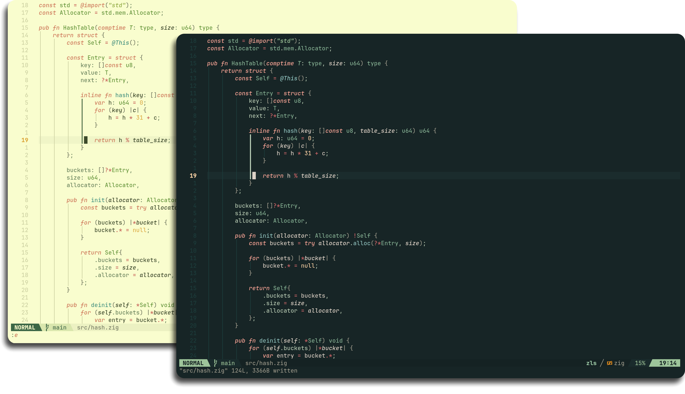
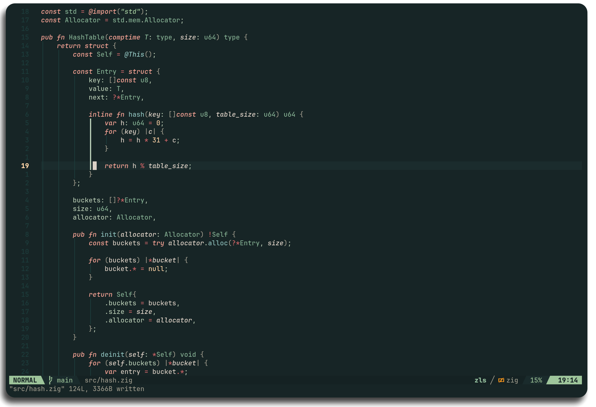
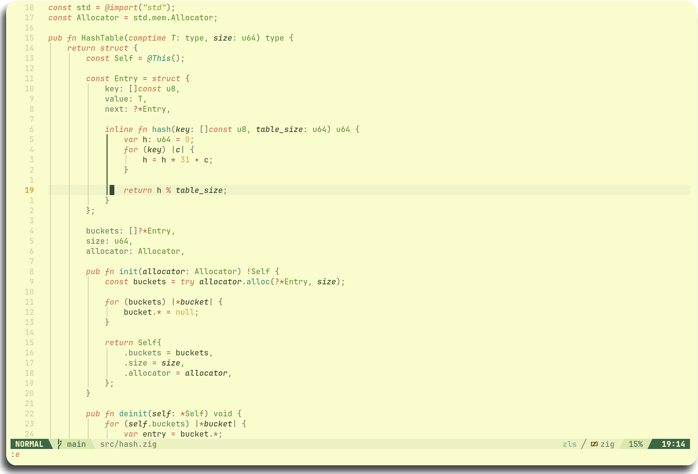

<h3 align="center">
    Thorn<br/>
    
</h3>

<p align="center">
    <a href="https://github.com/jpwol/thorn.nvim/stargazers"></a>
    <a href="https://github.com/jpwol/thorn.nvim/issues"></a>
    <a href="https://github.com/jpwol/thorn.nvim/issues"></a>
</p>

<div align="center">
    
</div>

Thorn is a rich, green theme made to solve two issues with many themes:

##### Too many highlights

Many themes have a vast amount of highlights, creating a sort of abstract painting when looking at code. Thorn aims to cut down on the amount of different colors with a _small_ palette, making code much more traversable at a glance.

##### Too high contrast

A lot of dark themes are only dark in the sense of their backgrounds. For those with sensitive eyes, high contrast highlights can be straining after awhile. Thorn mitigates this by using soft, low-contrast highlights that are still easily readable, making a long session much more sustainable on the eyes.

## Table of Contents

- [Previews](#previews)
- [Features](#features)
- [Installation](#installation)
  - [Extras Installation](#extras-installation)
- [Usage](#usage)
- [Configuration](#configuration)

---

#### Previews

<details>
    <summary> Forest </summary>
    
</details>
<details>
    <summary> Field </summary>
    
</details>

## Features

- Written in 100% Lua
- **Dark** and **Light** themes available
  - See [Configuration](#configuration) for details
- Plugin support
  - [lazy.nvim](https://github.com/folke/lazy.nvim)
  - [telescope.nvim](https://github.com/nvim-telescope/telescope.nvim)
  - [gitsigns.nvim](https://github.com/lewis6991/gitsigns.nvim)
  - [trouble.nvim](https://github.com/folke/trouble.nvim)
  - [nvim-cmp](https://github.com/hrsh7th/nvim-cmp)
  - [blink.cmp](https://github.com/saghen/blink.cmp)
  - [nvim-tree.lua](https://github.com/nvim-tree/nvim-tree.lua)
  - [lualine.nvim](https://github.com/nvim-lualine/lualine.nvim)
  - [bufferline.nvim](https://github.com/akinsho/bufferline.nvim)
  - [snacks.nvim](https://github.com/folke/snacks.nvim)
  - [render-markdown.nvim](https://github.com/MeanderingProgrammer/render-markdown.nvim)
  - [oil.nvim](https://github.com/stevearc/oil.nvim)
  - [oil-git.nvim](https://github.com/malewicz1337/oil-git.nvim)
  - [mini.nvim](https://github.com/nvim-mini/mini.nvim)
- Comes with added themes for **other applications** (see [extras](https://github.com/jpwol/thorn.nvim/tree/main/extras))!
  - [Ghostty](https://github.com/ghostty-org/ghostty)
  - [Kitty](https://github.com/kovidgoyal/kitty)
  - [Alacritty](https://github.com/alacritty/alacritty)
  - [Btop](https://github.com/aristocratos/btop)
  - [Opencode](https://opencode.ai/)
  - [tmux](https://github.com/tmux/tmux)
  - [lazygit](https://github.com/jesseduffield/lazygit)
  - [bat](https://github.com/sharkdp/bat)
  - [fzf](https://github.com/junegunn/fzf)
  - [delta](https://github.com/dandavison/delta)

> [!note]
> If you want support for a plugin, open an issue and it **WILL** be added!

## Installation

[vim.pack](https://github.com/neovim/neovim) (neovim 0.12+)

```lua
vim.pack.add({ src = "https://github.com/jpwol/thorn.nvim" })
```

[lazy.nvim](https://github.com/folke/lazy.nvim)

```lua
{
    "jpwol/thorn.nvim",
    lazy = false,
    priority = 1000,
    opts = {}
}
```

[packer.nvim](https://github.com/wbthomason/packer.nvim)

```lua
use {
    "jpwol/thorn.nvim",
    config = function()
        require("thorn").setup({})
    end,
}
```

[vim-plug](https://github.com/junegunn/vim-plug)

```lua
Plug 'jpwol/thorn.nvim', { 'branch': 'main' }
```

## Usage

```lua
-- after plugin is loaded by your manager
vim.cmd([[colorscheme thorn]])
```

For _LuaLine_

```lua
require("lualine").setup({
    options = {
        theme = "thorn" -- "auto" also detects theme automatically
    }
})
```

## Configuration

_thorn_ provides a good amount of customization options, as well as a way to change the color/style of any highlight group of your choosing.

In your plugin setup ([lazy.nvim](https://github.com/folke/lazy.nvim) plugin structure used as reference),

```lua
return {
    "jpwol/thorn.nvim",
    lazy = false,
    priority = 1000,
    opts = {
        theme = nil, -- 'forest' or 'field' - defaults to vim.o.background if unset

        transparent = false, -- transparent background
        terminal = true, -- terminal colors

        styles = {
            keywords = { italic = true, bold = false },
            comments = { italic = true, bold = false },
            strings  = { italic = true, bold = false },

            diagnostic = {
                underline = true, -- if true, flat underlines will be used. Otherwise, undercurls will be used

                -- true will apply the bg highlight, false applies the fg highlight
                error = { highlight = true, },
                hint  = { highlight = false, },
                info  = { highlight = false, },
                warn  = { highlight = false, },
            },
        },

        on_highlights = function(hl, palette) end, -- apply your own highlights
    },
}
```

Where `on_highlights` will be a function, and you can edit any highlight group as follows

```lua
on_highlights = function(hl, palette)

    -- setting options by member preserves other options for that group
    hl.String.bold = true
    hl.Function.fg = "#D9ADD4"

    -- setting options by table will CLEAR any other options for that group
    hl.Keyword = { fg = "#F9ADA0", italic = true } -- would clear bold and bg if they were set


    -- you can also use the theme's palette
    hl.String.fg = palette.green_0
end
```

## Extras Installation

To install additional themes from [extras](https://github.com/jpwol/thorn.nvim/tree/main/extras), follow these steps

If installing _thorn_ with a neovim package manager, locate the install location. For `vim.pack`, it should be `~/.local/share/nvim/site/pack/core/opt/thorn.nvim`, but paths may vary depending on distrobution and configuration.

Otherwise, clone this repository with `git clone https://github.com/jpwol/thorn.nvim`.

Usually, applications (e.g., Ghostty/Kitty/Alacritty/Btop) rely on a `themes` folder within the `~/.config/<application>` directory. If you haven't created that folder within the relevant directory, please do so. Then simply copy the theme files into the target application's theme directory.

```bash
# assuming you're in the thorn.nvim directory

# copying the contents of the application's folder
cp extras/ghostty/* ~/.config/ghostty/themes/

# Alternatively, you can create a symbolic link (linux)
cp -s extras/ghostty/* ~/.config/ghostty/themes/
```

After this, the theme will be available for whichever application you choose, and you can apply it like you normally would.

For **ghostty**, you can use `ghostty +list-themes` to preview the themes, and set them in your `config` file with `theme = Thorn <Style> <Background>`.

For **kitty**, you can simply use `kitten themes` to preview and apply the theme.

For **btop**, the theme should appear in the settings menu for selection.

For **opencode**, copy the files from `extras/opencode` to `~/.config/opencode/themes`, then select them from `/themes`.

For **alacritty**, you would use

```toml
import = [
    # thorn_style_background.toml being one of the 4 provided themes
    "~/.config/alacritty/themes/thorn_style_background.toml"
]
```

in your `alacritty.toml` config file.

For **tmux**, add this to your `tmux.conf` (this assumes you're using `~/.config/tmux` instead of `~/.tmux.conf`)

```tmux
set -g @thorn-tmux "forest" # can be 'forest' or 'field', default is 'forest'
run-shell "/path/to/thorn.tmux"
```

Keep in mind that `thorn-forest.conf`, `thorn-field.conf`, and `thorn.tmux` should all be in the same directory.

The path to _thorn's_ tmux theme can be anywhere, but it would preferrably be copied or symlinked to `~/.config/tmux/` or `~/.config/tmux/plugins`.

For **noctalia-shell**, copy or symlink the `Thorn/` folder containing `Thorn.json` into `~/.config/noctalia/colorschemes/`. _Thorn_ will then be available in _noctalia's_
colorscheme choices.

For **lazygit**, the files in `extras/lazygit` are YAML snippets — merge the contents of `thorn-forest.yml` (or `thorn-field.yml`) into your `~/.config/lazygit/config.yml` under the existing `gui:` section. If you don't have a `config.yml`, you can copy the file directly.

For **bat**, copy the `.tmTheme` files into bat's themes directory and rebuild the cache:

```bash
mkdir -p "$(bat --config-dir)/themes"
cp extras/bat/*.tmTheme "$(bat --config-dir)/themes/"
bat cache --build
```

Then select the theme with `bat --theme="Thorn Forest"` (or `Thorn Field`), or set it persistently via the `BAT_THEME` environment variable or in `bat`'s config file.

For **fzf**, source the desired snippet from your shell rc (`.bashrc`, `.zshrc`, etc.):

```sh
source /path/to/thorn.nvim/extras/fzf/thorn-forest.sh
# or
source /path/to/thorn.nvim/extras/fzf/thorn-field.sh
```

The snippet appends `--color=` flags to `FZF_DEFAULT_OPTS`.

For **delta**, the files in `extras/delta` are gitconfig snippets that define a named delta feature. Install the matching `bat` theme first (delta uses it for syntax highlighting), then include the snippet from your gitconfig:

```gitconfig
[include]
    path = /path/to/thorn.nvim/extras/delta/thorn-forest.gitconfig

[delta]
    features = thorn-forest
```

Swap `thorn-forest` for `thorn-field` for the light variant. Both snippets reference the matching `Thorn Forest` / `Thorn Field` bat tmTheme, so the bat extras must be installed and the cache rebuilt (`bat cache --build`) for delta's syntax highlighting to render correctly.
